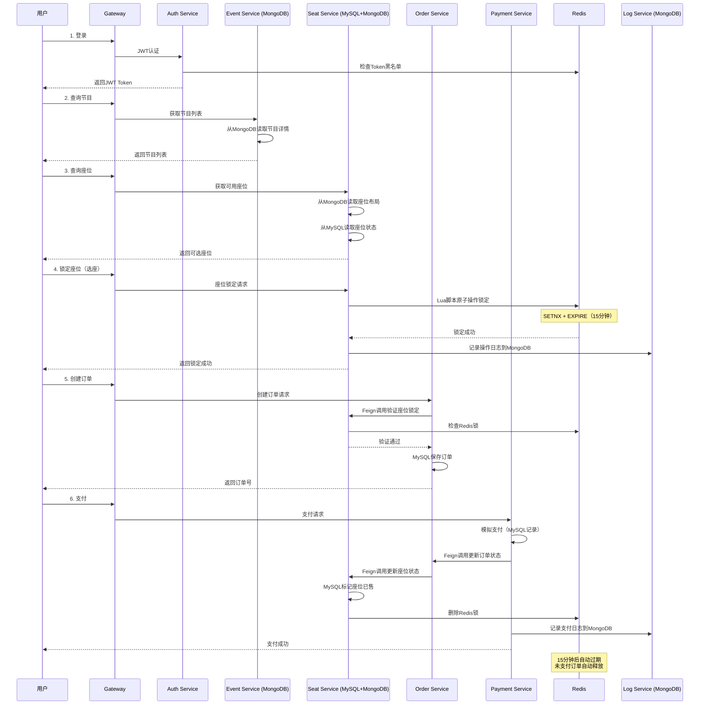

# 🎟 微服务订票平台（MySQL + MongoDB 混合架构）

## 项目概述

这是一个企业级的微服务订票平台，支持会员注册登录、节目查询、座位查询、下单、付款等完整功能。

### 技术栈

**后端：**
- Spring Boot 3.1.5（多模块 Maven）
- Spring Cloud Gateway + Nacos + OpenFeign
- Spring Security + JWT + Redis 黑名单
- Spring Data JPA（MySQL） + Spring Data MongoDB
- Redis（座位锁定、防超卖）
- Lombok + MapStruct

**前端：**
- Vue 3（Composition API + `<script setup>`）
- Vue Router + Pinia
- Axios + Element Plus

**DevOps：**
- Docker + Kubernetes
- Jenkins CI/CD
- Nexus Repository

## 数据库架构设计

### MySQL（事务性、强一致性数据）
| 服务 | 表名 | 说明 |
|------|------|------|
| auth-service | t_user | 用户表（认证信息） |
| order-service | t_order | 订单表 |
| payment-service | t_payment_record | 支付记录表 |
| seat-service | t_seat_status | 座位状态表 |

### MongoDB（灵活schema、文档型数据）
| 服务 | Collection | 说明 |
|------|------------|------|
| event-service | events | 节目详情（包含复杂的嵌套数据） |
| seat-service | seat_layouts | 座位布局图（复杂的图形数据） |
| log-service | operation_logs | 用户操作日志 |
| log-service | audit_logs | 系统审计日志 |

## 项目结构

```
ticket-system/
├── pom.xml                     # 父POM（包含MySQL+MongoDB依赖）
├── common-utils/               # 公共工具模块
│   ├── response/               # 统一响应
│   ├── exception/              # 异常处理
│   ├── util/                   # 工具类（JWT, Redis）
│   └── constant/               # 常量定义
├── gateway-service/            # API网关（端口8080）
│   ├── filter/                 # JWT认证过滤器
│   └── config/                 # 跨域配置
├── auth-service/               # 认证服务（端口8081, MySQL）
│   ├── entity/User.java        # 用户实体
│   ├── security/               # Spring Security配置
│   └── service/AuthService     # 登录、注册、登出逻辑
├── event-service/              # 节目服务（端口8082, MongoDB）
│   ├── document/Event.java     # MongoDB文档
│   ├── repository/             # MongoRepository
│   └── service/                # 节目CRUD + 缓存
├── seat-service/               # 座位服务（端口8083, MySQL+MongoDB）
│   ├── entity/SeatStatus.java  # MySQL座位状态
│   ├── document/SeatLayout     # MongoDB座位布局
│   ├── service/                # 座位锁定（Redis Lua脚本）
│   └── controller/             # 座位查询、锁定、解锁API
├── order-service/              # 订单服务（端口8084, MySQL）
│   ├── entity/Order.java       # 订单实体
│   ├── service/                # 订单创建、状态更新
│   └── feign/                  # Feign调用其他服务
├── payment-service/            # 支付服务（端口8085, MySQL）
│   ├── entity/PaymentRecord    # 支付记录
│   └── service/                # 模拟支付逻辑
├── log-service/                # 日志服务（端口8086, MongoDB）
│   ├── document/               # 日志文档
│   └── service/                # 日志记录和查询
├── frontend/                   # Vue3前端
│   ├── src/
│   │   ├── api/                # API封装
│   │   ├── views/              # 页面组件
│   │   │   ├── Login.vue
│   │   │   ├── EventList.vue
│   │   │   ├── SeatSelect.vue
│   │   │   └── OrderConfirm.vue
│   │   ├── store/              # Pinia状态管理
│   │   └── router/             # 路由配置
│   ├── package.json
│   └── vite.config.js
├── k8s/                        # Kubernetes配置
│   ├── namespace.yaml
│   ├── mysql-deployment.yaml
│   ├── mongodb-deployment.yaml
│   ├── redis-deployment.yaml
│   ├── nacos-deployment.yaml
│   ├── gateway-deployment.yaml
│   ├── *-service-deployment.yaml
│   ├── ingress.yaml
│   └── configmap.yaml
├── docker/                     # Docker配置
│   ├── Dockerfile.backend      # 后端镜像
│   ├── Dockerfile.frontend     # 前端镜像
│   └── docker-compose.yml      # 本地开发环境
├── Jenkinsfile                 # CI/CD流水线
└── docs/                       # 文档目录
    ├── architecture.md         # 架构设计
    ├── api.md                  # API文档
    ├── database.md             # 数据库设计
    ├── deployment.md           # 部署文档
    └── flow.md                 # 业务流程图
```

## 核心功能流程

### 购票流程（防超卖设计）



## 快速开始

### 前置要求
- JDK 17+
- Maven 3.8+
- Docker & Kubernetes
- MySQL 8.0+
- MongoDB 5.0+
- Redis 6.0+
- Nacos 2.2+
- Node.js 18+

### 本地开发

1. **启动基础设施**
```bash
# 使用Docker Compose启动MySQL、MongoDB、Redis、Nacos
cd docker
docker-compose up -d
```

2. **构建项目**
```bash
cd ticket-system
mvn clean install
```

3. **启动微服务**
```bash
# 启动网关
cd gateway-service && mvn spring-boot:run

# 启动认证服务
cd auth-service && mvn spring-boot:run

# 启动其他服务...
```

4. **启动前端**
```bash
cd frontend
npm install
npm run dev
```

5. **访问应用**
- 前端: http://localhost:5173
- 网关: http://localhost:8080
- Swagger文档: http://localhost:8081/swagger-ui.html

### Kubernetes部署

```bash
# 创建namespace
kubectl apply -f k8s/namespace.yaml

# 部署基础设施
kubectl apply -f k8s/mysql-deployment.yaml
kubectl apply -f k8s/mongodb-deployment.yaml
kubectl apply -f k8s/redis-deployment.yaml
kubectl apply -f k8s/nacos-deployment.yaml

# 部署微服务
kubectl apply -f k8s/

# 查看部署状态
kubectl get pods -n ticket-system
```

## API文档

### 认证接口
- `POST /auth/register` - 用户注册
- `POST /auth/login` - 用户登录
- `POST /auth/logout` - 用户登出
- `POST /auth/refresh` - 刷新Token

### 节目接口（MongoDB）
- `GET /event/list` - 获取节目列表
- `GET /event/{id}` - 获取节目详情
- `POST /event` - 创建节目（管理员）
- `PUT /event/{id}` - 更新节目
- `DELETE /event/{id}` - 删除节目

### 座位接口（MySQL+MongoDB）
- `GET /seat/list/{eventId}` - 获取座位列表
- `GET /seat/layout/{eventId}` - 获取座位布局图（MongoDB）
- `POST /seat/lock` - 锁定座位（Redis）
- `POST /seat/unlock` - 解锁座位

### 订单接口
- `POST /order/create` - 创建订单
- `GET /order/{orderNo}` - 查询订单
- `GET /order/list` - 我的订单列表

### 支付接口
- `POST /payment/pay` - 支付订单
- `GET /payment/{orderNo}` - 查询支付状态

## 核心特性

### 1. JWT + Redis 黑名单
- 用户登出后Token加入Redis黑名单
- 网关统一验证Token有效性
- Token过期自动从黑名单移除

### 2. 座位防超卖
- Redis Lua脚本原子操作
- SETNX + EXPIRE实现分布式锁
- 15分钟超时自动释放

### 3. MySQL + MongoDB 混合架构
- MySQL：事务性数据（订单、支付）
- MongoDB：灵活数据（节目详情、日志）
- 根据业务特点选择合适的数据库

### 4. 微服务通信
- Feign声明式调用
- Nacos服务发现
- 负载均衡

### 5. 统一网关
- JWT认证
- 跨域处理
- 路由转发
- 限流熔断

## 监控与日志

- **日志收集**: Log Service（MongoDB）
- **链路追踪**: Spring Cloud Sleuth
- **监控指标**: Spring Boot Actuator
- **可视化**: Grafana + Prometheus

## 贡献指南

查看 [CONTRIBUTING.md](docs/CONTRIBUTING.md)

## 许可证

MIT License

## 联系方式

- 项目主页: https://github.com/yourusername/ticket-system
- 问题反馈: https://github.com/yourusername/ticket-system/issues
