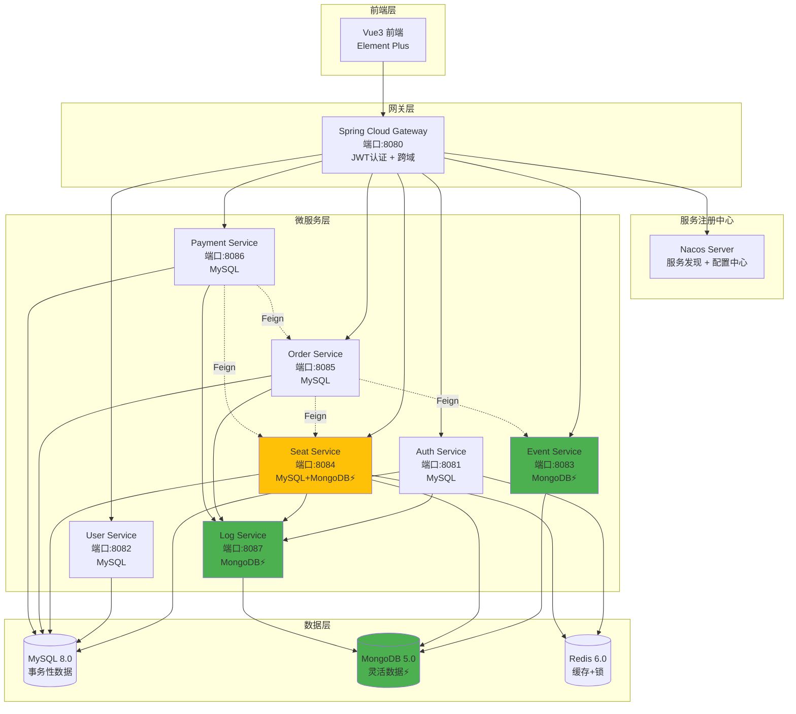
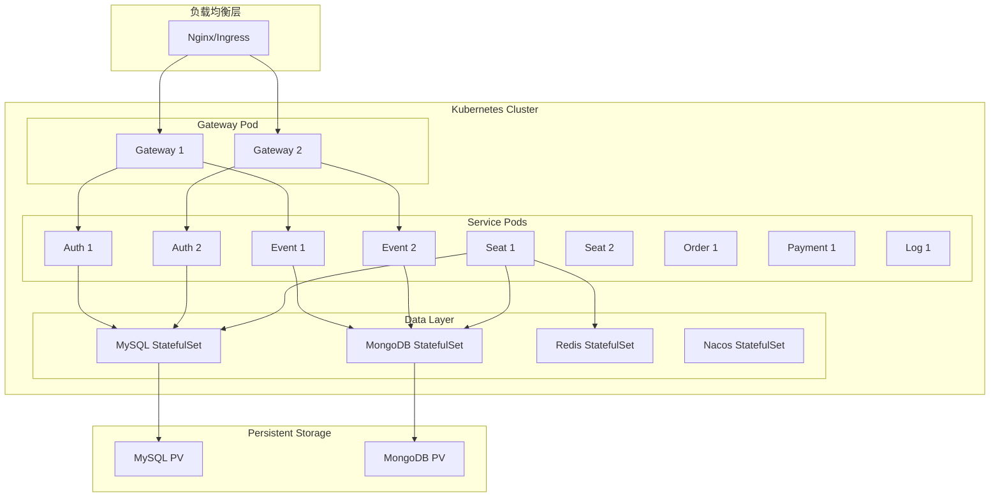

# 微服务订票平台 - 架构设计文档

## 1. 系统架构图



## 2. 数据库设计

### 2.1 MySQL 数据库（ticket_system）

#### 用户表（t_user）- Auth Service
```sql
CREATE TABLE t_user (
    id BIGINT PRIMARY KEY AUTO_INCREMENT,
    username VARCHAR(50) NOT NULL UNIQUE COMMENT '用户名',
    password VARCHAR(255) NOT NULL COMMENT '密码（BCrypt加密）',
    email VARCHAR(50) NOT NULL UNIQUE COMMENT '邮箱',
    phone VARCHAR(20) COMMENT '手机号',
    nickname VARCHAR(50) COMMENT '昵称',
    real_name VARCHAR(50) COMMENT '真实姓名',
    role VARCHAR(20) NOT NULL DEFAULT 'USER' COMMENT '角色：USER/ADMIN',
    status INT NOT NULL DEFAULT 1 COMMENT '状态：0-禁用，1-启用',
    create_time DATETIME NOT NULL DEFAULT CURRENT_TIMESTAMP,
    update_time DATETIME DEFAULT CURRENT_TIMESTAMP ON UPDATE CURRENT_TIMESTAMP,
    INDEX idx_username (username),
    INDEX idx_email (email)
) ENGINE=InnoDB DEFAULT CHARSET=utf8mb4 COMMENT='用户表';
```

#### 座位状态表（t_seat_status）- Seat Service
```sql
CREATE TABLE t_seat_status (
    id BIGINT PRIMARY KEY AUTO_INCREMENT,
    event_id BIGINT NOT NULL COMMENT '节目ID（对应MongoDB的events._id）',
    seat_number VARCHAR(50) NOT NULL COMMENT '座位号',
    zone_name VARCHAR(50) COMMENT '区域名称',
    status VARCHAR(20) NOT NULL DEFAULT 'AVAILABLE' COMMENT '状态：AVAILABLE/LOCKED/SOLD',
    user_id BIGINT COMMENT '锁定/购买用户ID',
    lock_time DATETIME COMMENT '锁定时间',
    sold_time DATETIME COMMENT '售出时间',
    create_time DATETIME NOT NULL DEFAULT CURRENT_TIMESTAMP,
    update_time DATETIME DEFAULT CURRENT_TIMESTAMP ON UPDATE CURRENT_TIMESTAMP,
    UNIQUE KEY uk_event_seat (event_id, seat_number),
    INDEX idx_event_id (event_id),
    INDEX idx_status (status),
    INDEX idx_user_id (user_id)
) ENGINE=InnoDB DEFAULT CHARSET=utf8mb4 COMMENT='座位状态表';
```

#### 订单表（t_order）- Order Service
```sql
CREATE TABLE t_order (
    id BIGINT PRIMARY KEY AUTO_INCREMENT,
    order_no VARCHAR(50) NOT NULL UNIQUE COMMENT '订单号',
    user_id BIGINT NOT NULL COMMENT '用户ID',
    event_id BIGINT NOT NULL COMMENT '节目ID',
    event_name VARCHAR(255) NOT NULL COMMENT '节目名称',
    seat_numbers JSON NOT NULL COMMENT '座位号列表',
    total_amount DECIMAL(10,2) NOT NULL COMMENT '总金额',
    status VARCHAR(20) NOT NULL DEFAULT 'PENDING' COMMENT '状态：PENDING/PAID/CANCELLED/EXPIRED',
    create_time DATETIME NOT NULL DEFAULT CURRENT_TIMESTAMP,
    expire_time DATETIME NOT NULL COMMENT '过期时间（15分钟）',
    pay_time DATETIME COMMENT '支付时间',
    cancel_time DATETIME COMMENT '取消时间',
    INDEX idx_order_no (order_no),
    INDEX idx_user_id (user_id),
    INDEX idx_status (status),
    INDEX idx_create_time (create_time)
) ENGINE=InnoDB DEFAULT CHARSET=utf8mb4 COMMENT='订单表';
```

#### 支付记录表（t_payment_record）- Payment Service
```sql
CREATE TABLE t_payment_record (
    id BIGINT PRIMARY KEY AUTO_INCREMENT,
    payment_no VARCHAR(50) NOT NULL UNIQUE COMMENT '支付流水号',
    order_no VARCHAR(50) NOT NULL COMMENT '订单号',
    user_id BIGINT NOT NULL COMMENT '用户ID',
    amount DECIMAL(10,2) NOT NULL COMMENT '支付金额',
    payment_method VARCHAR(20) NOT NULL COMMENT '支付方式：ALIPAY/WECHAT/BALANCE',
    status VARCHAR(20) NOT NULL DEFAULT 'PENDING' COMMENT '状态：PENDING/SUCCESS/FAILED',
    transaction_id VARCHAR(100) COMMENT '第三方交易号',
    create_time DATETIME NOT NULL DEFAULT CURRENT_TIMESTAMP,
    success_time DATETIME COMMENT '成功时间',
    INDEX idx_payment_no (payment_no),
    INDEX idx_order_no (order_no),
    INDEX idx_user_id (user_id)
) ENGINE=InnoDB DEFAULT CHARSET=utf8mb4 COMMENT='支付记录表';
```

### 2.2 MongoDB 数据库（ticket_system）

#### 节目集合（events）- Event Service ⚡
```javascript
{
    "_id": ObjectId("..."),
    "name": "周杰伦演唱会",
    "category": "CONCERT",
    "venue": {
        "name": "鸟巢体育场",
        "address": "北京市朝阳区国家体育场南路1号",
        "city": "北京",
        "latitude": 39.9928,
        "longitude": 116.3979,
        "capacity": 91000,
        "facilities": {
            "parking": true,
            "restaurant": true,
            "accessibility": true
        }
    },
    "startTime": ISODate("2024-12-25T19:00:00Z"),
    "endTime": ISODate("2024-12-25T22:00:00Z"),
    "poster": "https://cdn.example.com/posters/jay-concert.jpg",
    "description": "<p>周杰伦2024世界巡回演唱会...</p>",
    "performers": [
        {
            "name": "周杰伦",
            "role": "主唱",
            "avatar": "https://cdn.example.com/avatars/jay.jpg",
            "bio": "华语流行音乐天王..."
        }
    ],
    "priceZones": [
        {"zoneName": "VIP", "price": 1980, "color": "#FFD700", "totalSeats": 500, "availableSeats": 120},
        {"zoneName": "A区", "price": 880, "color": "#FF6B6B", "totalSeats": 2000, "availableSeats": 856},
        {"zoneName": "B区", "price": 580, "color": "#4ECDC4", "totalSeats": 3000, "availableSeats": 1245}
    ],
    "totalSeats": 5500,
    "availableSeats": 2221,
    "status": "ON_SALE",
    "tags": ["流行", "华语", "演唱会", "周杰伦"],
    "metadata": {
        "duration": "180分钟",
        "language": "中文",
        "ageLimit": "全年龄",
        "lateEntry": false
    },
    "rating": {
        "score": 9.5,
        "count": 12567,
        "distribution": {
            "5": 10245,
            "4": 1890,
            "3": 345,
            "2": 67,
            "1": 20
        }
    },
    "createTime": ISODate("2024-01-15T10:00:00Z"),
    "updateTime": ISODate("2024-06-20T15:30:00Z"),
    "createBy": "admin"
}

// 索引设计
db.events.createIndex({"category": 1})
db.events.createIndex({"status": 1})
db.events.createIndex({"venue.city": 1})
db.events.createIndex({"startTime": 1})
db.events.createIndex({"tags": 1})
db.events.createIndex({"rating.score": -1})
db.events.createIndex({"name": "text"})  // 全文搜索
```

#### 座位布局集合（seat_layouts）- Seat Service ⚡
```javascript
{
    "_id": ObjectId("..."),
    "eventId": "507f1f77bcf86cd799439011",
    "layoutType": "STADIUM",  // THEATER/STADIUM/CINEMA
    "zones": [
        {
            "zoneName": "VIP",
            "color": "#FFD700",
            "rows": [
                {
                    "rowNumber": "A",
                    "seats": [
                        {"seatNumber": "A1", "x": 100, "y": 50, "angle": 0},
                        {"seatNumber": "A2", "x": 120, "y": 50, "angle": 0}
                    ]
                }
            ]
        }
    ],
    "metadata": {
        "width": 1920,
        "height": 1080,
        "scale": 1.0,
        "stage": {
            "x": 960,
            "y": 100,
            "width": 400,
            "height": 50
        }
    },
    "createTime": ISODate("2024-01-15T10:00:00Z"),
    "updateTime": ISODate("2024-01-15T10:00:00Z")
}

// 索引
db.seat_layouts.createIndex({"eventId": 1}, {unique: true})
```

#### 操作日志集合（operation_logs）- Log Service ⚡
```javascript
{
    "_id": ObjectId("..."),
    "userId": 12345,
    "username": "zhangsan",
    "operation": "LOCK_SEAT",
    "requestUri": "/seat/lock",
    "method": "POST",
    "params": {
        "eventId": "507f1f77bcf86cd799439011",
        "seatNumbers": ["A1", "A2"]
    },
    "ip": "192.168.1.100",
    "userAgent": "Mozilla/5.0...",
    "duration": 125,  // 毫秒
    "status": "SUCCESS",
    "timestamp": ISODate("2024-06-20T15:30:25Z")
}

// 索引
db.operation_logs.createIndex({"userId": 1, "timestamp": -1})
db.operation_logs.createIndex({"operation": 1})
db.operation_logs.createIndex({"timestamp": -1})
db.operation_logs.createIndex({"timestamp": 1}, {expireAfterSeconds: 2592000})  // 30天后自动删除
```

#### 审计日志集合（audit_logs）- Log Service
```javascript
{
    "_id": ObjectId("..."),
    "action": "USER_LOGIN",
    "actor": {
        "userId": 12345,
        "username": "zhangsan",
        "role": "USER",
        "ip": "192.168.1.100"
    },
    "target": {
        "type": "USER",
        "id": "12345"
    },
    "changes": {
        "before": {"lastLoginTime": "2024-06-19T10:00:00Z"},
        "after": {"lastLoginTime": "2024-06-20T15:30:25Z"}
    },
    "metadata": {
        "device": "iPhone",
        "browser": "Safari",
        "location": "北京市"
    },
    "timestamp": ISODate("2024-06-20T15:30:25Z")
}

// 索引
db.audit_logs.createIndex({"actor.userId": 1, "timestamp": -1})
db.audit_logs.createIndex({"action": 1})
db.audit_logs.createIndex({"timestamp": -1})
```

### 2.3 Redis 数据结构

#### JWT 黑名单
```
Key: jwt:blacklist:{token}
Value: "1"
TTL: Token剩余有效时间
```

#### 座位锁定
```
Key: seat:lock:{eventId}:{seatNumber}
Value: {userId}
TTL: 900秒（15分钟）
```

#### 节目缓存
```
Key: event:info:{eventId}
Value: JSON(Event对象)
TTL: 3600秒（1小时）
```

#### 座位布局缓存
```
Key: seat:layout:{eventId}
Value: JSON(SeatLayout对象)
TTL: 7200秒（2小时）
```

## 3. 微服务通信

### 3.1 Feign接口定义

```java
// Order Service -> Seat Service
@FeignClient(name = "seat-service", path = "/seat")
public interface SeatFeignClient {
    @GetMapping("/verify-lock")
    Result<Boolean> verifyLock(@RequestParam Long eventId,
                               @RequestParam List<String> seatNumbers,
                               @RequestParam Long userId);

    @PostMapping("/confirm-sold")
    Result<Void> confirmSold(@RequestParam Long eventId,
                             @RequestParam List<String> seatNumbers);
}

// Payment Service -> Order Service
@FeignClient(name = "order-service", path = "/order")
public interface OrderFeignClient {
    @PutMapping("/update-status")
    Result<Void> updateStatus(@RequestParam String orderNo,
                              @RequestParam String status);
}
```

## 4. Redis Lua 脚本

### 4.1 座位锁定脚本（防止超卖）
```lua
-- KEYS[1]: seat:lock:{eventId}:{seatNumber}
-- ARGV[1]: userId
-- ARGV[2]: expire (seconds)

local key = KEYS[1]
local userId = ARGV[1]
local expire = tonumber(ARGV[2])

-- 检查座位是否已被锁定
if redis.call('exists', key) == 0 then
    -- 座位未锁定，设置锁并返回成功
    redis.call('set', key, userId)
    redis.call('expire', key, expire)
    return 1
else
    -- 座位已被锁定，返回失败
    return 0
end
```

### 4.2 座位解锁脚本（只有锁持有者可以解锁）
```lua
-- KEYS[1]: seat:lock:{eventId}:{seatNumber}
-- ARGV[1]: userId

local key = KEYS[1]
local userId = ARGV[1]

-- 检查锁是否属于当前用户
if redis.call('get', key) == userId then
    -- 是当前用户的锁，删除并返回成功
    redis.call('del', key)
    return 1
else
    -- 不是当前用户的锁，返回失败
    return 0
end
```

### 4.3 批量座位锁定脚本（原子操作）
```lua
-- KEYS: seat:lock:{eventId}:{seatNumber1}, seat:lock:{eventId}:{seatNumber2}, ...
-- ARGV[1]: userId
-- ARGV[2]: expire (seconds)

local userId = ARGV[1]
local expire = tonumber(ARGV[2])

-- 第一步：检查所有座位是否都可用
for i, key in ipairs(KEYS) do
    if redis.call('exists', key) == 1 then
        -- 有座位已被锁定，返回失败
        return 0
    end
end

-- 第二步：锁定所有座位
for i, key in ipairs(KEYS) do
    redis.call('set', key, userId)
    redis.call('expire', key, expire)
end

return 1
```

## 5. API 端点总览

| 服务 | 端口 | 主要端点 | 数据库 |
|------|------|----------|--------|
| Gateway | 8080 | /* | Redis |
| Auth | 8081 | /auth/* | MySQL + Redis |
| User | 8082 | /user/* | MySQL |
| Event | 8083 | /event/* | **MongoDB** ⚡ |
| Seat | 8084 | /seat/* | MySQL + **MongoDB** + Redis ⚡ |
| Order | 8085 | /order/* | MySQL |
| Payment | 8086 | /payment/* | MySQL |
| Log | 8087 | /log/* | **MongoDB** ⚡ |

## 6. 部署架构



## 7. 核心技术特性

### 7.1 为什么选择 MongoDB？

| 场景 | 原因 |
|------|------|
| **节目详情** | 灵活schema，支持复杂嵌套结构（场馆、演出者、票价区域） |
| **座位布局** | 存储复杂的二维坐标数据，前端直接使用 |
| **操作日志** | 高写入性能，自动过期（TTL索引） |
| **审计日志** | 灵活的查询条件，无需预定义schema |

### 7.2 为什么选择 MySQL？

| 场景 | 原因 |
|------|------|
| **用户认证** | 强一致性，事务支持 |
| **订单系统** | ACID特性，金额计算精确 |
| **支付记录** | 强一致性，审计要求高 |
| **座位状态** | 事务支持，状态变更原子性 |

### 7.3 混合架构的优势

1. **性能优化**：MongoDB的高写入性能用于日志，MySQL的事务保证金融数据安全
2. **灵活性**：MongoDB支持动态schema，适应快速变化的业务需求
3. **成本效益**：根据数据特点选择最合适的存储方案
4. **开发效率**：MongoDB的JSON格式直接映射到前端，减少转换成本

## 8. 安全设计

### 8.1 认证流程
1. 用户登录 → Auth Service验证 → 生成JWT
2. JWT包含：userId、username、role、过期时间
3. Gateway验证JWT → 提取用户信息 → 转发到后端服务
4. 用户登出 → JWT加入Redis黑名单

### 8.2 座位锁定流程
1. 用户选座 → 调用Seat Service
2. Redis Lua脚本原子操作锁定
3. 15分钟内完成支付，否则自动释放
4. 支付成功 → MySQL更新座位状态 → 删除Redis锁

### 8.3 防止超卖机制
1. Redis分布式锁（SETNX + EXPIRE）
2. Lua脚本保证原子性
3. MySQL乐观锁（version字段）
4. 双重校验（Redis + MySQL）

## 9. 监控与运维

### 9.1 日志收集
- 应用日志 → Logstash → Elasticsearch → Kibana
- 操作日志 → MongoDB（Log Service）

### 9.2 监控指标
- Prometheus采集 → Grafana可视化
- 关键指标：QPS、响应时间、错误率、座位锁定成功率

### 9.3 告警规则
- 服务不可用 → 钉钉/邮件通知
- Redis连接失败 → 紧急告警
- MySQL慢查询 → 性能告警
- MongoDB磁盘使用率 > 80% → 容量告警

---

更多详细信息请查看：
- [API文档](./api.md)
- [部署文档](./deployment.md)
- [数据库设计](./database.md)
